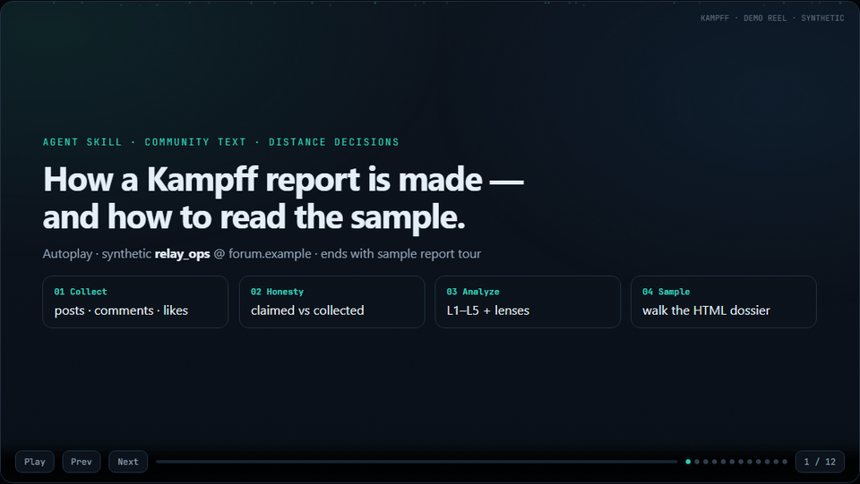

# Kampff

### Read the board. Not the vibes.

[](https://github.com/YangKangSung/kampff-skills/stargazers)
[](LICENSE)
[](kampff/SKILL.md)

[](docs/demo-kampff-walkthrough.html)

**▶** GIF autoplays above · click for [interactive demo](docs/demo-kampff-walkthrough.html) (`Space` pause) · [mp4](docs/demo-reel.mp4)

---

## Sample report

### → [**Open sample HTML report**](docs/sample-community-report.html)

Markdown twin: [sample-community-report.md](docs/sample-community-report.md) · short workplace cut: [sample-output.md](docs/sample-output.md)

> **Synthetic only.** Demo person `relay_ops` @ `forum.example`.  
> Real third-party dossiers never belong in this repo.

### Excerpt — matrix + distance

| id | worldview_fit | alliance_fit | stability | drift | risk | one_line |
|----|---------------|--------------|-----------|-------|------|----------|
| me | baseline | — | — | — | low | Prefers written decisions + small PRs |
| **relay_ops** | **partial** (CI / reliability craft) | **conditional engage** | **chronic postmortem writer** | **tool loyalty follows green builds** | harm **low** · process fights **med** | **CI operator; measures, then swaps** |

**Distance:** `neutral` ~ soft-`engage` · **not** `avoid`

| Situation | Tag |
|-----------|-----|
| CI flakiness / rollback / observability | **engage** |
| Default community peer | **neutral** |
| Vendor cheer without repro | **caution** |

**One-liner**

> `relay_ops` = reliability operator + verificationist poster. Loyal to **green that means something**, not to brands. Trigger reply = same-orbit counter-report, not a personal attack.

### Excerpt — collection honesty

| Surface | Claimed | Collected | Full? |
|---------|---------|-----------|-------|
| Posts | 12 | 12 bodies | **YES** |
| Comments | 120 | 40 recent (API cap) | **NO** |
| Likes | 45 | 8 unique | **NO** |

### Excerpt — lenses

| Lens | Sample result |
|------|----------------|
| **MBTI** (fun) | `ISTJ` lean · I~70 S~62 T~80 J~75 |
| **CIA-SAT / ACH** | **H1 Verificationist** lead · drivers: control 3 · autonomy 3 · status 1 |
| **L5 drift** | Vendor X v3 praise → v4 cancel = same trait (verify utility, not brand) |

Inside the HTML: driver radar · Big Five · timeline · force-directed text graph · full L1–L5 · KGB-style dossier card.

---

## What is Kampff?

> **sickn33 profiles customers. i-am profiles you.**  
> **Kampff profiles everyone on the board — including you.**

An **agent skill** that turns published text into a distance decision:

```text
posts · comments · mail · chat  →  bundle.json  →  /kampff  →  dossier
```

| You get | In plain English |
|---------|------------------|
| **Distance** | `engage` · `neutral` · `caution` · `avoid` |
| **Fit** | worldview + alliance vs *you* |
| **Time** | ephemeris — how they *changed* |
| **Proof** | every claim tied to a quote (or low-confidence) |

No soul verdicts. No “born evil.” Just **patterns + evidence**.

---

## Install (any agent)

Same skill file. Drop it in **your** harness:

| Agent | Path |
|-------|------|
| Hermes | `~/.hermes/skills/kampff` |
| Claude Code | `~/.claude/skills/kampff` |
| Grok | `~/.grok/skills/kampff` |
| Cursor | `.cursor/skills/kampff` |

```bash
git clone https://github.com/YangKangSung/kampff-skills.git
cp -r kampff-skills/kampff ~/.hermes/skills/kampff   # pick your path
```

```text
/kampff analyze path/to/bundle.json
/kampff member {platform} {id}     # community pipeline
/kampff today
```

Optional data dir: `export KAMPFF_DATA=~/kampff-data` (Windows: `setx KAMPFF_DATA "..."`)

---

## How it works

```text
┌─────────────┐     ┌──────────────┐     ┌─────────────────┐
│  Collect    │ ──▶ │ bundle.json  │ ──▶ │  spectrograph   │
│  (optional) │     │  + honesty   │     │  L1–L5 + lenses │
└─────────────┘     └──────────────┘     └────────┬────────┘
                                                  ▼
                                         distance report
                                      (.md · optional .html)
```

1. **Collect** lawful text (your tools, or optional `kampff-collect`)
2. **Honesty** — posts / comments / likes: claimed vs collected (no fake “full crawl”)
3. **Analyze** — skill reads files only; never invents scrape mid-report
4. **Decide** — engage cost, not a persuasion playbook

Community boards are a **first-class pipeline**, not a one-off script:  
[community-member-pipeline.md](docs/community-member-pipeline.md) · [report-template.md](docs/report-template.md)

---

## spectrograph

| Layer | Job |
|-------|-----|
| L1 | Psych lean (Big Five-ish · conflict style) |
| L2 | Worldview axes |
| L3 | Behavioral signature (chronic vs one-off) |
| L4 | Alliance / go-together |
| L5 | Ephemeris — timeline & drift |
| L6–L7 | HR / OSINT — only if asked · lawful only |

**Community defaults (on):**

| Lens | Vibe |
|------|------|
| [MBTI](docs/lenses-mbti.md) | Fun · low validity · never sole `avoid` |
| [CIA-SAT + dossier card](docs/lenses-cia-sat.md) | Public analytic form · ACH · not ops |

```yaml
analysis_lenses: ["personal", "mbti", "cia_sat"]
```

---

## vs the rest

| Skill | Who it profiles |
|-------|-----------------|
| customer profilers | **Buyers** for marketing |
| i-am / self skills | **You** from agent logs |
| chat stats tools | Word counts + vibes |
| **kampff** | **The board** + **you** + time + distance |

---

## Rules of the game

**Do**

- Quote or mark confidence  
- Put the viewer under the same protocol  
- Keep real runs under `$KAMPFF_DATA` (outside git)

**Don’t**

- Medical / legal diagnosis  
- Stalking or covert collection  
- Commit real people, tokens, or host dumps to this repo  
- Confuse “deleted a file” with “gone from git history”

Samples use fiction only: `relay_ops`, `user_42`, `north_packet`.

---

## Repo map

```text
kampff/                 ← the skill (copy this)
  SKILL.md
  references/           ← pipeline · honesty · lenses · template
docs/
  demo-kampff-walkthrough.html   ← top of README
  sample-community-report.html   ← under the demo
  sample-*.md · spectrograph · collectors
collectors/             ← optional YAML packs (adapters maturing)
```

---

## Star roadmap

| ⭐ | Unlock |
|----|--------|
| shipped | L1–L5 + community pipeline + sample HTML |
| 100 | Ephemeris templates |
| 300 | HR lens pack |
| 500 | OSINT lens pack |
| 1000 | Skill #2 |

**[Sponsor](https://github.com/sponsors/YangKangSung)** · **[Issues](https://github.com/YangKangSung/kampff-skills/issues)**

---

## Name & license

**Kampff** — independent OSS by [YangKangSung](https://github.com/YangKangSung).  
Not affiliated with any film/game franchise. Name ≈ *struggle to read sparse evidence*.

**MIT** — use wisely, cite quotes, respect local law.  
Third-party tools: [THIRD_PARTY_NOTICES.md](THIRD_PARTY_NOTICES.md)

```text
graphify  →  code  →  graph
kampff    →  text  →  human spectrum
```
