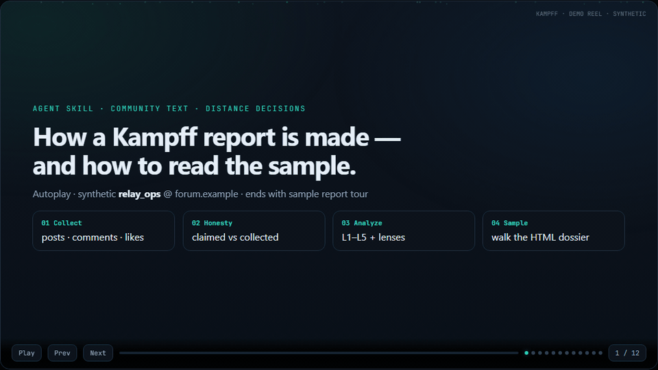

# Kampff

### Read the board. Not the vibes.

[](https://github.com/YangKangSung/kampff-skills/stargazers)
[](LICENSE)
[](kampff/SKILL.md)
[](docs/README.md)
[](CHANGELOG.md)

[](https://yangkangsung.github.io/kampff-skills/demo-kampff-walkthrough.html)

**▶** GIF autoplays above · click for <a href="https://yangkangsung.github.io/kampff-skills/demo-kampff-walkthrough.html" target="_blank" rel="noopener noreferrer"><strong>interactive demo</strong></a> (`Space` pause) · <a href="https://yangkangsung.github.io/kampff-skills/demo-reel.mp4" target="_blank" rel="noopener noreferrer">mp4</a>

---

## Live site

→ <a href="https://yangkangsung.github.io/kampff-skills/" target="_blank" rel="noopener noreferrer"><strong>Pages home</strong></a> (product landing) · docs table: [docs/docs-index.md](docs/docs-index.md)

## Sample report

### → <a href="https://yangkangsung.github.io/kampff-skills/sample-community-report.html" target="_blank" rel="noopener noreferrer"><strong>Open sample HTML report</strong></a> ↗

Live page (not GitHub source). Markdown twin: [sample-community-report.md](docs/sample-community-report.md) · short workplace cut: [sample-output.md](docs/sample-output.md)

> **Synthetic only.** Demo person `relay_ops` @ `forum.example`.  
> Real third-party dossiers never belong in this repo.

**Dual-track HTML (default):** top toggle **쉬운 말** (plain distance / do·don't) · **전문 분석** (graphs · L1–L5 · lenses). First open defaults to 쉬운 말; choice sticks in `localStorage`. See [report-tracks.md](docs/report-tracks.md).

### Excerpt — matrix + distance

| id | worldview_fit | alliance_fit | stability | drift | risk | one_line |
|----|---------------|--------------|-----------|-------|------|----------|
| me | baseline | — | — | — | low | Prefers written decisions + small PRs |
| **relay_ops** | **partial** (CI / reliability craft) | **conditional engage** | **chronic postmortem writer** | **tool loyalty follows green builds** | harm **low** · process fights **med** | **CI operator; measures, then swaps** |

**Distance:** `neutral` ~ soft-`engage` · **not** `avoid`

| Situation | Tag |
|-----------|-----|
| CI flakiness / rollback / observability | **engage** |
| Default community peer | **neutral** |
| Vendor cheer without repro | **caution** |

**One-liner**

> `relay_ops` = reliability operator + verificationist poster. Loyal to **green that means something**, not to brands. Trigger reply = same-orbit counter-report, not a personal attack.

### Excerpt — collection honesty

| Surface | Claimed | Collected | Full? |
|---------|---------|-----------|-------|
| Posts | 12 | 12 bodies | **YES** |
| Comments | 120 | 40 recent (API cap) | **NO** |
| Likes | 45 | 8 unique | **NO** |

### Excerpt — lenses

| Lens | Sample result |
|------|----------------|
| **MBTI** (fun) | `ISTJ` lean · I~70 S~62 T~80 J~75 |
| **CIA-SAT / ACH** | **H1 Verificationist** lead · drivers: control 3 · autonomy 3 · status 1 |
| **Clinical** (비진단) | Task-bound affect · not a DSM label |
| **L5 drift** | Vendor X v3 praise → v4 cancel = same trait (verify utility, not brand) |

Inside the HTML: driver radar · Big Five · timeline · force-directed text graph · full L1–L5 · KGB-style dossier card · easy/pro track toggle.

---

## What is Kampff?

> **sickn33 profiles customers. i-am profiles you.**  
> **Kampff profiles everyone on the board — including you.**

An **agent skill** that turns published text into a distance decision:

```text
posts · comments · mail · chat  →  bundle.json  →  /kampff  →  dossier
```

| You get | In plain English |
|---------|------------------|
| **Distance** | `engage` · `neutral` · `caution` · `avoid` |
| **Fit** | worldview + alliance vs *you* |
| **Time** | ephemeris — how they *changed* |
| **Proof** | every claim tied to a quote (or low-confidence) |

No soul verdicts. No “born evil.” Just **patterns + evidence**.

---

## Install (any agent)

Same skill file. Drop it in **your** harness:

| Agent | Path |
|-------|------|
| Hermes | `~/.hermes/skills/kampff` |
| Claude Code | `~/.claude/skills/kampff` |
| Grok | `~/.grok/skills/kampff` |
| Cursor | `.cursor/skills/kampff` |

```bash
git clone https://github.com/YangKangSung/kampff-skills.git
cp -r kampff-skills/kampff ~/.hermes/skills/kampff   # pick your path
```

```text
/kampff analyze path/to/bundle.json
/kampff member {platform} {id}     # community pipeline
/kampff today
/kampff drill                      # synthetic practice (hide GOLD first)
/kampff drill 01
```

Optional data dir: `export KAMPFF_DATA=~/kampff-data` (Windows: `setx KAMPFF_DATA "..."`)

### Render HTML (offline)

```bash
# dual-track default (쉬운 말 + 전문 분석 toggle)
python scripts/render_kampff_report.py \
  -a path/to-analysis.json \
  -o path/to-report.html

# pro only · easy only
python scripts/render_kampff_report.py -a … -o … --track pro
python scripts/render_kampff_report.py -a … -o …-easy.html --track easy
```

Needs a filled `analysis.json` (agent output or [sample-analysis.json](docs/sample-analysis.json)). Schema notes: [report-analysis.schema.md](docs/report-analysis.schema.md).

---

## How it works

```text
┌─────────────┐     ┌──────────────┐     ┌─────────────────┐
│  Collect    │ ──▶ │ bundle.json  │ ──▶ │  spectrograph   │
│  (optional) │     │  + honesty   │     │  L1–L5 + lenses │
└─────────────┘     └──────────────┘     └────────┬────────┘
                                                  ▼
                                         distance report
                              (.html dual-track DEFAULT · .md twin)
```

1. **Collect** lawful text (your tools, or optional `kampff-collect`)
2. **Honesty** — posts / comments / likes: claimed vs collected (no fake “full crawl”)
3. **Analyze** — skill reads files only; never invents scrape mid-report
4. **Decide** — engage cost, not a persuasion playbook

Community boards are a **first-class pipeline**, not a one-off script:  
[community-member-pipeline.md](docs/community-member-pipeline.md) · [report-template.md](docs/report-template.md)

---

## spectrograph

| Layer | Job |
|-------|-----|
| L1 | Psych lean (Big Five-ish · conflict style) |
| L2 | Worldview axes |
| L3 | Behavioral signature (chronic vs one-off) |
| L4 | Alliance / go-together |
| L5 | Ephemeris — timeline & drift |
| L6–L7 | HR / OSINT — only if asked · lawful only |

**Community defaults (on):**

| Lens | Vibe |
|------|------|
| [MBTI](docs/lenses-mbti.md) | Fun · low validity · never sole `avoid` |
| [Clinical](docs/lenses-clinical-psych.md) | Formulation only · **비진단** · never sole `avoid` |
| [CIA-SAT + dossier card](docs/lenses-cia-sat.md) | Public analytic form · ACH · not ops |

```yaml
analysis_lenses: ["personal", "mbti", "cia_sat", "clinical"]
```

---

## Practice drills (synthetic)

Train distance + quote discipline **without** real people.

| ID | Case | Gold distance (after score) | Trains |
|----|------|------------------------------|--------|
| **01** | [`docs/drills/01-criteria-peer/`](docs/drills/01-criteria-peer/) | neutral ~ soft-engage | brand flip ≠ flip-flop · criteria-bound affect |
| **02** | [`docs/drills/02-status-flex/`](docs/drills/02-status-flex/) | caution | empty flex · meeting cost |

```text
/kampff drill 01          # brief + texts only — hide GOLD
/kampff drill score 01    # then open GOLD + rubric
```

Rubric: [docs/drills/rubric.md](docs/drills/rubric.md) · craft map: [docs/profiling-craft.md](docs/profiling-craft.md)

**Local smoke (this tree):** subject `gate_runner` (drill 01) scored **90/100 sharp** with dual-track HTML render green (2026-08-09 ad-hoc). Artifacts stay out of git.

---

## vs the rest

| Skill | Who it profiles |
|-------|-----------------|
| customer profilers | **Buyers** for marketing |
| i-am / self skills | **You** from agent logs |
| chat stats tools | Word counts + vibes |
| **kampff** | **The board** + **you** + time + distance |

---

## Rules of the game

**Do**

- Quote or mark confidence  
- Put the viewer under the same protocol  
- Keep real runs under `$KAMPFF_DATA` (outside git)

**Don’t**

- Medical / legal diagnosis  
- Stalking or covert collection  
- Commit real people, tokens, or host dumps to this repo  
- Confuse “deleted a file” with “gone from git history”

Samples + drills use fiction only: `relay_ops`, `gate_runner`, `north_packet`, `forum.example`.

---

## Repo map

```text
kampff/                 ← the skill (copy this)
  SKILL.md
  references/           ← pipeline · honesty · lenses · template
docs/
  drills/               ← synthetic deliberate practice
  report-tracks.md      ← dual-track HTML (easy / pro)
  sample-*.md · spectrograph · collectors
  RUN-INPUT.md
scripts/
  render_kampff_report.py
  kampff_report_easy.py
collectors/             ← optional YAML packs (adapters maturing)
kampff-data/            ← local runs only (gitignored)
```

---

## Star roadmap

| ⭐ | Unlock |
|----|--------|
| shipped | L1–L5 + community pipeline + dual-track sample HTML + drills |
| 100 | Ephemeris templates |
| 300 | HR lens pack |
| 500 | OSINT lens pack |
| 1000 | Skill #2 |

**[Sponsor](https://github.com/sponsors/YangKangSung)** · **[Issues](https://github.com/YangKangSung/kampff-skills/issues)**

---

## Name & license

**Kampff** — independent OSS by [YangKangSung](https://github.com/YangKangSung).  
Not affiliated with any film/game franchise. Name ≈ *struggle to read sparse evidence*.

**MIT** — use wisely, cite quotes, respect local law.  
Third-party tools: [THIRD_PARTY_NOTICES.md](THIRD_PARTY_NOTICES.md)

```text
graphify  →  code  →  graph
kampff    →  text  →  human spectrum
```

---

## Contributing

Public PRs welcome — see [CONTRIBUTING.md](CONTRIBUTING.md).  
Docs map: [docs/README.md](docs/README.md) · [CHANGELOG.md](CHANGELOG.md)

Security reports: [SECURITY.md](SECURITY.md)
